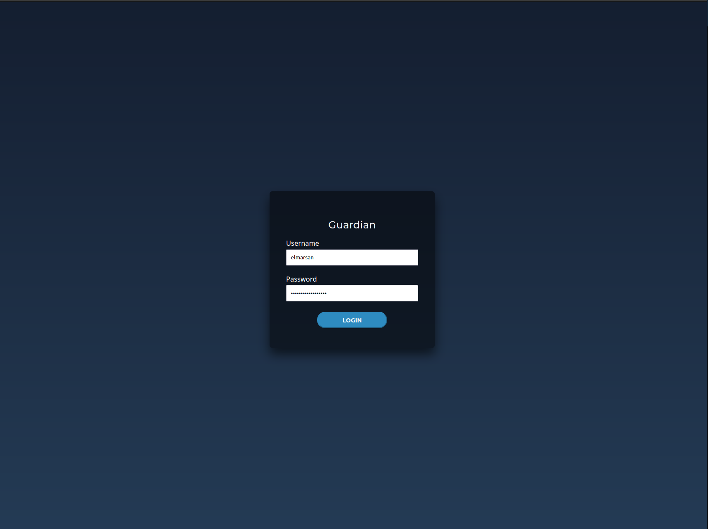

# Guardian

Http file server protected by jwt written in Go.

## Requirements

### Environment Variables

| Variable Name | Required | Description | Example Value |
|----------------|-------------|---------------|----------|
| `JWT_KEY` | YES | Secret for signing jww tokens | `ef51c9fc4b73b74149f8dd0a0ee5e9aaf605a1cb` |
| `JWT_EXPIRATION_TIME` | NO | Time in minutes for expire jwt policy | `60` |
| `DATABASE_URL` | YES | Sqlite database url | `./test.db` |

### Demo and screenshots

[Screencast 2023-01-28 10:20:42.webm](https://user-images.githubusercontent.com/43180519/215258178-bab542a8-03dd-4229-b0d8-6423274cf506.webm)
